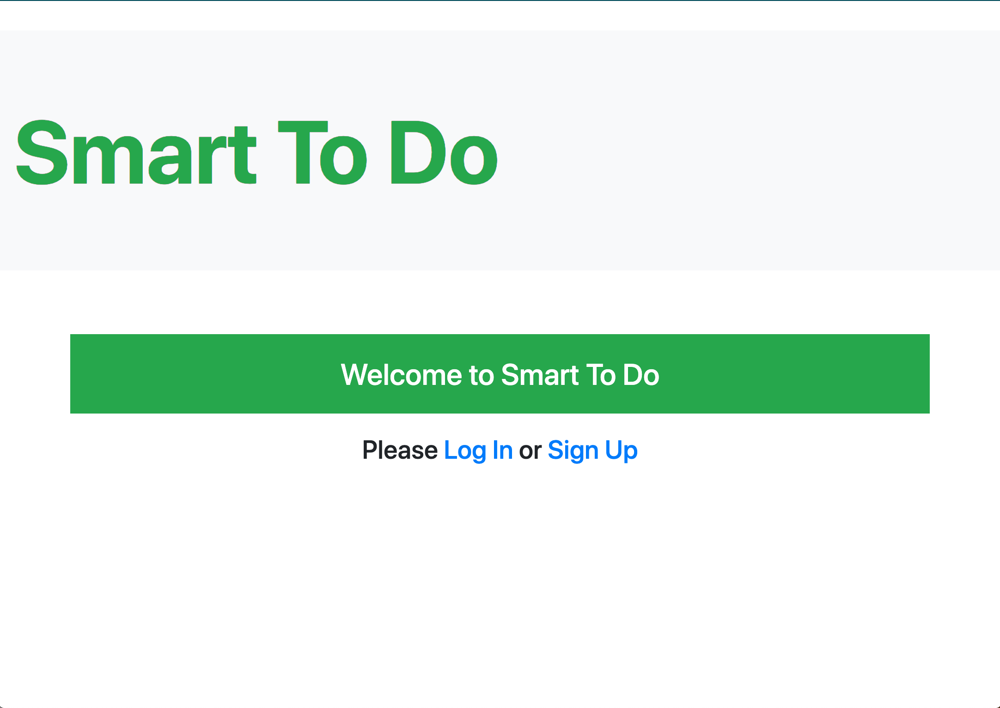
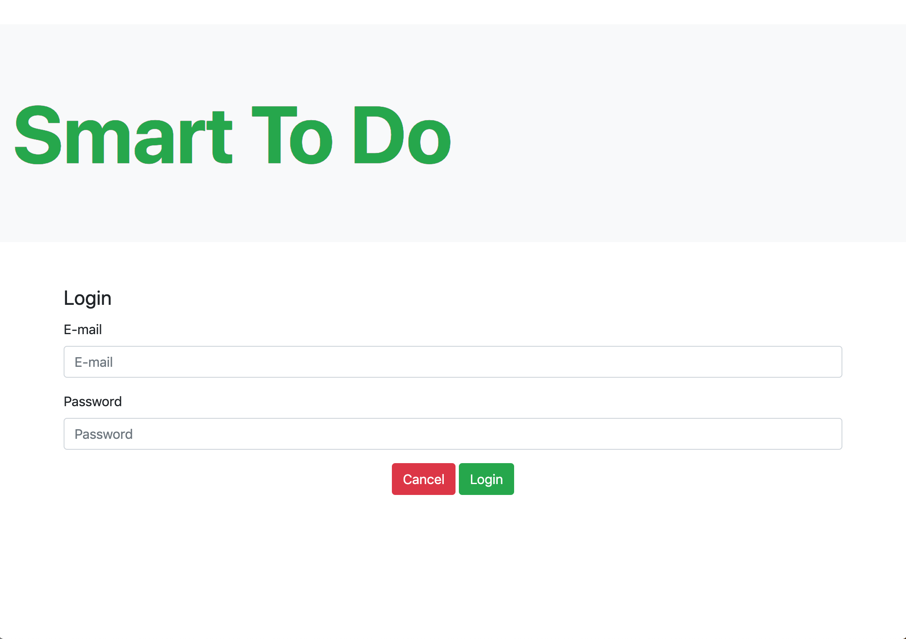
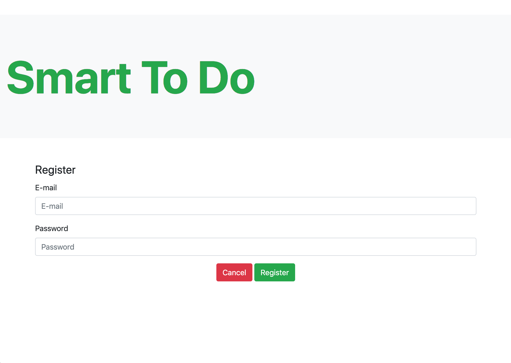

# Smart To Do List

When you are recommended something it's not always easy to jot it down for later in an organized fashion. Adding the item to your phone or computer ends up taking time and opening up the right app is only part of the problem. You then have to locate the right list ("Movies to watch", "Books to read", etc.) to add to. And if you do get it in to the right list, you don't have much more context about it. This delay and lack of additional information acts as a huge deterrent.

The solution? A smart, auto-categorizing todo list app. The user simply has to add the name of the thing, and it gets put into the correct list.

## Project Requirements:

Each todo created should be categorized as one of:

* Film / Series (To watch)
* Restaurants, cafes, etc. (To eat)
* Books (To read)
* Products (To buy)

In order to determine the category the app will probably need to use various API services such as those offered by Google, Wolfram Alpha, Rotten Tomatoes, Amazon, Yelp and others.

API services mentioned above are only suggestions. You will have to investigate how to balance the accurate categorization of items with having to deal with multiple API endpoints.

Users should be able to change a category of an item in case it was mis-categorized or could not be categorized at all.

Users should be able to register, log in, log out and update their profile.

## Getting Started

1. Install dependencies using the `npm install` command.
2. Start the web server using the `npm run local` command. The app will be served at <http://localhost:8080/>.
3. Go to <http://localhost:8080/> in your browser.

## Dependencies

- node-skeleton 1.0.0
- body-parser 1.15.2
- dotenv 2.0.0
- ejs 2.4.1
- express 4.13.4
- knex 0.16.5
- knex-logger 0.1.0
- morgan 1.7.0
- node-sass-middleware 0.11.0
- pg 6.0.2
- wolfram-alpha-api 1.0.0
- bcrypt 3.0.6
- bootstrap 4.3.1
- cookie-session 1.3.3
- nodemon 1.9.2

## Final Product Screenshots

### Home page

### Login Page

### Registration

### Registration

